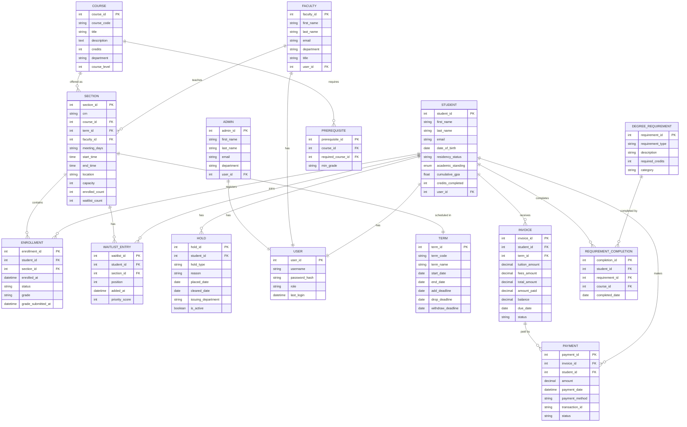
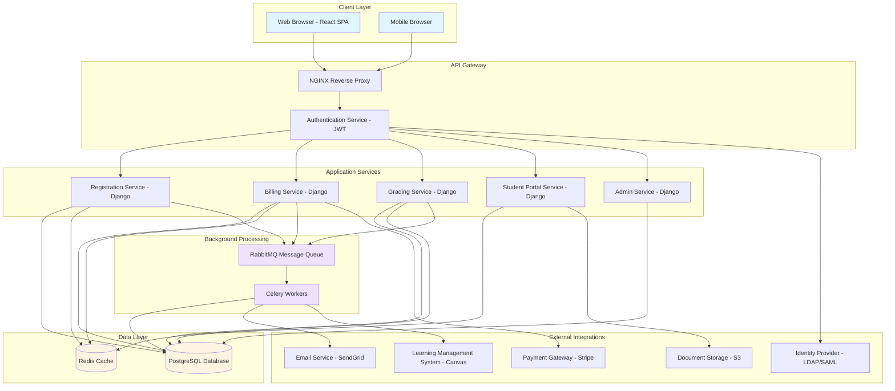

# UniPortal Requirements & Data Model

## Table of Contents
1. [Business Rules](#business-rules)
2. [Functional Requirements](#functional-requirements)
3. [Data Model (ER Diagram)](#data-model-er-diagram)
4. [System Architecture](#system-architecture)

---

## Business Rules

Business rules define the policies and constraints that govern UniPortal's behavior. These are derived from university academic policies and operational requirements.

### BR-001: Prerequisite Enforcement
**Rule:** A student may only register for a course if they have successfully completed all prerequisite courses with a grade of C- or better.
**Rationale:** Ensures students have foundational knowledge before advancing.
**Exception:** Department chair can grant prerequisite waiver with written justification.

### BR-002: Credit Hour Maximum Per Term
**Rule:** Undergraduate students may not enroll in more than 18 credit hours per term without dean approval. Graduate students are limited to 12 credit hours.
**Rationale:** Prevents academic overload and maintains quality of learning.
**Exception:** Students with GPA ≥ 3.5 may request overload approval via petition.

### BR-003: Time Conflict Prevention
**Rule:** A student cannot register for two sections that have overlapping meeting times.
**Rationale:** Physical impossibility of attending simultaneous classes.
**Exception:** Online asynchronous courses have no meeting time and never conflict.

### BR-004: Enrollment Capacity Management
**Rule:** A section cannot exceed its maximum enrollment capacity (seats available). Once full, students must join the waitlist.
**Rationale:** Classroom size, pedagogical effectiveness, fire code compliance.
**Exception:** Instructor may authorize capacity override on a case-by-case basis.

### BR-005: Waitlist Priority Order
**Rule:** Waitlist positions are assigned in the following priority order:
1. Students for whom the course is a degree requirement (major/minor)
2. Seniors (by credit hours completed)
3. Juniors, then Sophomores, then Freshmen
4. Within same priority level, first-come-first-served by waitlist timestamp
**Rationale:** Ensures graduating students can complete required courses.
**Implementation:** When a seat opens, the system auto-enrolls the highest-priority waitlisted student.

### BR-006: Add/Drop Deadline Enforcement
**Rule:**
- **Add Deadline:** Students may add courses through the end of the first week of classes.
- **Drop Deadline (no record):** Students may drop courses through the end of the second week with no transcript notation.
- **Withdraw Deadline:** Students may withdraw through week 10, receiving a "W" grade.
- **Post-Withdraw:** After week 10, student receives grade earned (A-F).
**Rationale:** Balances flexibility with academic integrity and administrative burden.

### BR-007: Tuition Refund Schedule
**Rule:** Tuition refunds for dropped courses follow this schedule:
- Drop before first day of term: 100% refund
- Drop during week 1: 100% refund
- Drop during week 2: 75% refund
- Drop during week 3-4: 50% refund
- Drop after week 4: 0% refund (no refund)
**Rationale:** Compensates university for committed resources while providing early-drop flexibility.
**Note:** Refunds process to original payment method within 10 business days.

### BR-008: Registration Hold System
**Rule:** Students with active holds cannot register for courses. Hold types include:
- **Financial Hold:** Outstanding balance ≥ $500
- **Advising Hold:** Must meet with academic advisor each term before registration
- **Immunization Hold:** Missing required health records
- **Conduct Hold:** Active disciplinary case
**Rationale:** Ensures compliance with financial, academic, and health/safety requirements.
**Resolution:** Hold must be cleared by issuing department before registration is enabled.

### BR-009: GPA Calculation Method
**Rule:** GPA is calculated as weighted average: `GPA = Σ(grade_points × credit_hours) / Σ(credit_hours)` where:
- A = 4.0, A- = 3.7, B+ = 3.3, B = 3.0, B- = 2.7, C+ = 2.3, C = 2.0, C- = 1.7, D+ = 1.3, D = 1.0, F = 0.0
- W (Withdraw), I (Incomplete), P (Pass), AU (Audit) do not count toward GPA
**Rationale:** Standard US university GPA calculation.
**Variants:** Cumulative GPA (all terms), Term GPA (single term), Major GPA (courses in major only).

### BR-010: Academic Standing Determination
**Rule:** Academic standing is determined each term based on cumulative GPA:
- **Good Standing:** GPA ≥ 2.0
- **Academic Warning:** GPA 1.75-1.99 (first occurrence)
- **Academic Probation:** GPA < 1.75 or second consecutive term with GPA < 2.0
- **Academic Suspension:** GPA < 1.5 after probation, or three consecutive probation terms
**Rationale:** Early intervention for struggling students; maintains academic standards.
**Consequence:** Students on probation limited to 12 credit hours and required to meet with advisor monthly.

### BR-011: Dean's List Criteria
**Rule:** Students qualify for Dean's List if:
- Term GPA ≥ 3.5
- Enrolled in at least 12 credit hours
- No grades of I (Incomplete), F, or D
**Rationale:** Recognizes academic excellence.
**Publication:** Dean's List published at end of each term; notation added to transcript.

### BR-012: Grade Submission Deadline
**Rule:** Faculty must submit final grades within 72 hours of the scheduled final exam time. Late submissions require department chair approval.
**Rationale:** Students need grades to plan next term; registrar needs time to process transcripts.
**Enforcement:** System sends automated reminders at 48 hours before deadline, at deadline, and every 12 hours after until submitted.

### BR-013: Grade Change Authorization
**Rule:** Once submitted, grades can only be changed by the instructor of record with written justification. Changes after 30 days require dean approval.
**Rationale:** Prevents grade inflation and ensures audit trail.
**Audit:** All grade changes logged with timestamp, reason, and approver.

### BR-014: Concurrent Enrollment Limit
**Rule:** A student cannot be enrolled as a degree-seeking student in two different programs simultaneously (e.g., cannot pursue BA and BS concurrently).
**Rationale:** Financial aid limitations, academic focus, university resource allocation.
**Exception:** Dual-degree programs explicitly approved by provost (e.g., BA/MBA 5-year program).

### BR-015: Repeat Course Policy
**Rule:** A student may repeat a failed course (grade < C-) to replace the grade. Only the higher grade counts toward GPA, but both attempts remain on transcript.
- Maximum 3 courses may be repeated for grade replacement
- Course must be repeated at the same institution
- Grade replacement does not apply to transferred courses
**Rationale:** Allows students to recover from early academic struggles.
**Financial Aid Impact:** Repeat courses count toward attempted credit hours for SAP (Satisfactory Academic Progress).

---

## Functional Requirements

Functional requirements specify what the system must do. Requirements are prioritized using MoSCoW method:
- **Must Have:** Critical for MVP launch
- **Should Have:** Important but not critical; early post-MVP
- **Could Have:** Desirable but can defer
- **Won't Have:** Out of scope for current version

### Registration Module

#### FR-REG-001: Course Search
**Priority:** Must Have
**Description:** Students shall be able to search courses by department, course number, title keyword, instructor name, term, and meeting days/times.
**Acceptance Criterion:** Search returns matching courses within 2 seconds; supports filters applied in combination (e.g., "CS courses on Tuesday/Thursday").

#### FR-REG-002: Course Catalog Display
**Priority:** Must Have
**Description:** System shall display course details including: title, credits, instructor, meeting times, location, seats available, waitlist count, and description.
**Acceptance Criterion:** All information visible without requiring click-through; updates in real-time as seats are taken.

#### FR-REG-003: Shopping Cart Management
**Priority:** Must Have
**Description:** Students shall be able to add courses to a shopping cart, remove courses, and view total credit hours before confirming registration.
**Acceptance Criterion:** Cart persists across sessions; displays total credit hours and tuition estimate.

#### FR-REG-004: Prerequisite Validation
**Priority:** Must Have
**Description:** System shall prevent adding courses to cart if student has not completed prerequisites (per BR-001).
**Acceptance Criterion:** Clear error message displays missing prerequisites with course codes; links to course catalog for reference.

#### FR-REG-005: Time Conflict Detection
**Priority:** Must Have
**Description:** System shall prevent adding courses to cart if meeting times conflict with already-enrolled or cart courses (per BR-003).
**Acceptance Criterion:** Visual schedule preview highlights conflict; error message names conflicting courses.

#### FR-REG-006: Real-Time Seat Availability
**Priority:** Must Have
**Description:** Seat counts shall update in real-time as students enroll, ensuring no overselling of sections.
**Acceptance Criterion:** When section reaches capacity during checkout, student receives error and course is removed from cart.

#### FR-REG-007: Registration Confirmation
**Priority:** Must Have
**Description:** Upon successful registration, system shall display confirmation page with enrolled courses, CRN numbers, and email receipt.
**Acceptance Criterion:** Confirmation email sent within 60 seconds; includes PDF class schedule attachment.

#### FR-REG-008: Drop Course
**Priority:** Must Have
**Description:** Students shall be able to drop enrolled courses through the drop deadline (per BR-006).
**Acceptance Criterion:** System calculates refund amount (per BR-007) and displays before confirming drop; updates transcript immediately.

#### FR-REG-009: Waitlist Enrollment
**Priority:** Should Have
**Description:** When section is full, students shall be able to join waitlist and view their position.
**Acceptance Criterion:** Waitlist position displayed; student receives email when moved to enrolled status.

#### FR-REG-010: Waitlist Auto-Enrollment
**Priority:** Should Have
**Description:** When a student drops a full course, the highest-priority waitlisted student (per BR-005) shall be automatically enrolled.
**Acceptance Criterion:** Auto-enrollment occurs within 60 seconds of drop; enrolled student receives email notification.

### Grading Module

#### FR-GRD-001: Grade Roster Access
**Priority:** Must Have
**Description:** Faculty shall access grade rosters for their sections showing all enrolled students.
**Acceptance Criterion:** Roster includes student name, ID, photo, and current grade (if entered); sortable by name or grade.

#### FR-GRD-002: Grade Entry
**Priority:** Must Have
**Description:** Faculty shall be able to enter letter grades (A, A-, B+, B, B-, C+, C, C-, D+, D, F) or special grades (W, I, P, AU) for each student.
**Acceptance Criterion:** Dropdown menu for grade selection; bulk save of all grades; autosaves draft grades.

#### FR-GRD-003: Grade Submission Deadline Enforcement
**Priority:** Must Have
**Description:** System shall enforce 72-hour grade submission deadline (per BR-012) and send reminder emails.
**Acceptance Criterion:** Grades locked after deadline unless extension granted; reminders sent at -48h, 0h, +12h, +24h.

#### FR-GRD-004: Grade Change Request
**Priority:** Must Have
**Description:** Faculty shall be able to submit grade change requests with written justification.
**Acceptance Criterion:** Form captures old grade, new grade, reason; routes to department chair for approval if within 30 days, dean if after 30 days (per BR-013).

#### FR-GRD-005: Student Grade View
**Priority:** Must Have
**Description:** Students shall view final grades for all completed courses, term GPA, and cumulative GPA.
**Acceptance Criterion:** Grades appear immediately upon faculty submission; GPA recalculated in real-time (per BR-009).

### Billing Module

#### FR-BIL-001: Tuition Calculation
**Priority:** Must Have
**Description:** System shall calculate tuition based on credit hours, residency status (in-state/out-of-state), program, and fees.
**Acceptance Criterion:** Calculation matches published tuition schedule; breakdowns displayed line-by-line (tuition + fees + room/board if applicable).

#### FR-BIL-002: Invoice Generation
**Priority:** Must Have
**Description:** System shall generate itemized invoices for each term showing charges, payments, and outstanding balance.
**Acceptance Criterion:** Invoice available as PDF download; emailed to student and parent email addresses on file.

#### FR-BIL-003: Payment Processing
**Priority:** Must Have
**Description:** Students shall be able to pay invoices via credit card, ACH bank transfer, or payment plan.
**Acceptance Criterion:** Payment gateway integration (Stripe or Nelnet); confirmation displayed immediately; receipt emailed.

#### FR-BIL-004: Payment Plan Enrollment
**Priority:** Should Have
**Description:** Students shall be able to enroll in monthly payment plans (e.g., 5 monthly installments) for term charges.
**Acceptance Criterion:** Auto-debit setup for recurring payments; email reminders 3 days before each installment.

#### FR-BIL-005: Refund Calculation
**Priority:** Must Have
**Description:** System shall calculate refund amount based on drop date (per BR-007).
**Acceptance Criterion:** Refund displayed before student confirms drop; processed to original payment method within 10 business days.

#### FR-BIL-006: Financial Hold Application
**Priority:** Must Have
**Description:** System shall automatically place financial hold on accounts with balance ≥ $500 (per BR-008).
**Acceptance Criterion:** Hold applied immediately when balance threshold crossed; prevents registration until cleared.

#### FR-BIL-007: 1098-T Tax Form Generation
**Priority:** Should Have
**Description:** System shall generate IRS Form 1098-T for each student by January 31st showing qualified tuition and fees paid.
**Acceptance Criterion:** Form available for download in student portal; mailed to address on file; submitted to IRS electronically.

### Student Portal Module

#### FR-POR-001: Dashboard Overview
**Priority:** Must Have
**Description:** Student dashboard shall display: weekly class schedule, current term GPA, account balance, active holds, and upcoming deadlines.
**Acceptance Criterion:** All information visible without scrolling on desktop; loads in < 3 seconds.

#### FR-POR-002: Weekly Schedule View
**Priority:** Must Have
**Description:** Students shall view their class schedule in calendar grid format (Monday-Friday, 8am-6pm).
**Acceptance Criterion:** Shows course code, title, location, and instructor for each meeting; color-coded by course.

#### FR-POR-003: Transcript Request
**Priority:** Should Have
**Description:** Students shall request official transcripts to be sent to other institutions or employers.
**Acceptance Criterion:** Select delivery method (electronic/mail), recipient address, quantity; pay $10 fee per transcript; processing within 2 business days.

#### FR-POR-004: Degree Audit Display
**Priority:** Could Have
**Description:** Students shall view degree audit showing completed requirements, in-progress courses, and remaining requirements for graduation.
**Acceptance Criterion:** Visual checklist format; shows credits completed vs. required for major, minor, general education.

#### FR-POR-005: Hold Resolution Guidance
**Priority:** Must Have
**Description:** When holds are present, system shall display hold type, issuing department, reason, and steps to resolve.
**Acceptance Criterion:** Clickable links to pay bill, schedule advising appointment, or upload immunization records.

### Administration Module

#### FR-ADM-001: Term Setup
**Priority:** Must Have
**Description:** Administrators shall create new academic terms with start/end dates, add/drop deadlines, and registration periods.
**Acceptance Criterion:** Calendar date pickers; validates that add deadline < drop deadline < withdraw deadline.

#### FR-ADM-002: Course Catalog Management
**Priority:** Must Have
**Description:** Administrators shall create and edit course catalog entries including title, description, credits, prerequisites, and attributes (writing-intensive, lab, etc.).
**Acceptance Criterion:** Rich text editor for description; multi-select for prerequisites; course history retained for auditing.

#### FR-ADM-003: Section Creation
**Priority:** Must Have
**Description:** Administrators shall create course sections with CRN, meeting times, location, instructor, and capacity.
**Acceptance Criterion:** Auto-generates CRN; conflict detection for room/time availability; bulk upload via CSV.

#### FR-ADM-004: Enrollment Reports
**Priority:** Should Have
**Description:** Administrators shall generate reports on enrollment statistics by term, department, and course level.
**Acceptance Criterion:** Exportable to Excel; includes metrics: total enrolled, seats available, waitlist count, percentage full.

#### FR-ADM-005: User Role Management
**Priority:** Must Have
**Description:** Administrators shall assign user roles (Student, Faculty, Staff, Admin) and manage permissions.
**Acceptance Criterion:** Role-based access control; audit log of permission changes.

---

## Data Model (ER Diagram)

The following entity-relationship diagram shows the complete UniPortal data model with all entities, attributes, and relationships.

See also: [er-diagram.mermaid](./er-diagram.mermaid)

---

## System Architecture

The following architecture diagram shows UniPortal's system components, data flow, and external integrations.

See also: [architecture.mermaid](./architecture.mermaid)

### Architecture Components

#### Client Layer
- **React SPA:** Single-page application built with React 18, Tailwind CSS, and React Router
- **State Management:** Redux for global state (cart, user session)
- **API Client:** Axios with interceptors for JWT token refresh

#### API Gateway
- **NGINX:** Reverse proxy, SSL termination, rate limiting, load balancing
- **Authentication Service:** JWT-based auth with refresh tokens; integrates with LDAP/SAML for SSO

#### Application Services (Django + DRF)
- **Registration Service:** Course search, cart management, enrollment processing, waitlist logic
- **Billing Service:** Invoice generation, payment processing, refund calculation, financial holds
- **Grading Service:** Grade entry, submission workflow, grade change requests, GPA calculation
- **Student Portal Service:** Dashboard, schedule view, transcript requests, hold resolution
- **Admin Service:** Term/course/section management, reporting, user role management

#### Data Layer
- **PostgreSQL:** Primary relational database; ACID compliance for financial transactions
- **Redis:** Session storage, real-time seat count caching, rate limiting counters

#### Background Processing
- **RabbitMQ:** Message queue for asynchronous tasks
- **Celery Workers:** Process enrollments, send emails, sync with LMS, generate reports

#### External Integrations
- **LMS (Canvas):** Roster sync via REST API; course creation automation
- **Payment Gateway (Stripe):** PCI-compliant credit card processing; webhooks for payment confirmation
- **LDAP/SAML:** Single sign-on with university identity provider
- **SendGrid:** Transactional emails (registration confirmations, grade notifications, payment receipts)
- **AWS S3:** Document storage (transcripts, tax forms, uploaded immunization records)

### Data Flow Example: Student Registration

1. Student searches for courses (React → API Gateway → Registration Service → PostgreSQL)
2. Results cached in Redis for 60 seconds
3. Student adds course to cart (stored in Redux + Redis session)
4. Student clicks "Register" → Registration Service validates prerequisites, conflicts, holds
5. If valid, enrollment record created in PostgreSQL (transaction with seat count update)
6. Message published to RabbitMQ: `enrollment.created`
7. Celery worker consumes message:
   - Sends confirmation email via SendGrid
   - Syncs roster to Canvas LMS
   - Checks waitlist for newly-opened seats in other courses (if student dropped something)
8. Real-time seat count updated in Redis; WebSocket broadcasts to all active search sessions

---

**Document Version:** 1.0
**Last Updated:** 2026-02-05
**Author:** Requirements Engineering Team
